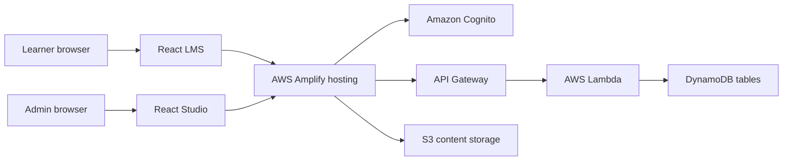

# CloudSecOp Platform MVP

[](LICENSE)
[](https://react.dev/)
[](https://aws.amazon.com/amplify/)
[](#)

CloudSecOp Platform MVP is a cloud security operations learning platform built with React and AWS Amplify. It provides a learner-facing LMS, an admin studio, course content, lectures, progress tracking, and certificate workflows for hands-on cloud security education.

## What This Project Demonstrates

- A full-stack learning platform built on AWS Amplify, React, DynamoDB, S3, Lambda, and API Gateway
- Separate experiences for learners (`lms`) and content administrators (`lms-studio`)
- Course and lecture data modeling for cloud security training programs
- Certificate lookup and learner progress flows
- A practical reference implementation for cloud security education communities

## Architecture



## Repository Structure

```text
cloudsecop-platform-mvp/
├── lms/                  # Learner-facing React application
├── lms-studio/           # Admin/content studio React application
├── sample-data/          # Example course and lecture payloads
├── LICENSE
└── README.md
```

## Local Development

### Prerequisites

- Node.js 18+
- npm
- AWS account with permissions to use Amplify, Cognito, Lambda, DynamoDB, S3, and API Gateway
- Amplify CLI configured with an AWS profile

Install the Amplify CLI if needed:

```bash
npm install -g @aws-amplify/cli
amplify configure
```

### Run the learner app

```bash
cd lms
npm install
npm start
```

### Run the admin studio

```bash
cd lms-studio
npm install
npm start
```

Both applications use `react-scripts`; local development starts on the default Create React App port unless another app is already using it.

## Deploy With AWS Amplify

Initialize and deploy each application from its own folder:

```bash
cd lms
amplify init
amplify push
```

Repeat the same flow for `lms-studio` if you want to deploy the admin application separately. Use separate environments such as `dev`, `staging`, and `prod` when testing infrastructure changes.

## Sample Data

Example course and lecture payloads are available in `sample-data/`:

```text
sample-data/
├── course/Course.json
└── lecture/Lecture-1.json ... Lecture-5.json
```

Use these files to seed DynamoDB tables during local testing or demo setup.

## Security Notes

- Do not commit generated AWS credentials, local environment files, or exported secrets.
- Review Amplify-generated IAM policies before production use.
- Use least-privilege roles for Lambda functions and CI/CD deployments.
- Keep learner and admin applications separated by Cognito groups or equivalent authorization controls.
- Store video/content assets in private S3 buckets unless the learning material is intended to be public.
- Dependency audit has been reduced with safe `npm audit fix` updates. Remaining alerts are tied to older Create React App and Amplify v5 dependency trees and should be handled through a planned Amplify v6 / modern React build migration.

## Roadmap

- Migrate from Create React App to Vite or another maintained React build tool
- Upgrade Amplify packages from v5 to v6 with authentication/API regression testing
- Document Amplify environment variables and backend resources
- Add screenshots or a short demo walkthrough
- Add seed scripts for course and lecture sample data
- Add role-based authorization examples for learner/admin workflows

## License

This project is licensed under the MIT License. See [LICENSE](LICENSE) for details.
